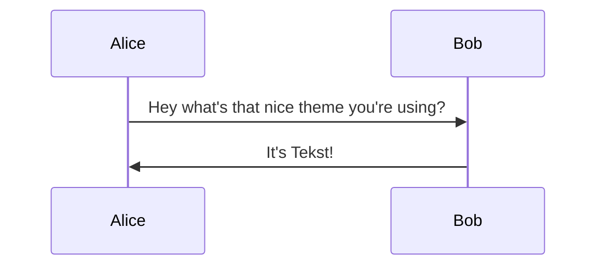

Miscellaneous settings.

## Home meta description

You can specify the homepage meta description with the following parameter:

```toml
[params]
description = "Your description"
```

## `json-ld` structured data

Tekst automatically generates `json-ld` structured data for some page types.
Templates for several page types are included in `layouts/_partials/json-ld`.
These templates are mapped to page types in `hugo.toml`:

```toml
[params.json-ld]
posts = { page = "blog-posting", section = "collection-page" }
publications = { page = "scholarly-article", section = "collection-page" }
```

The above configuration maps the `posts` collection to the `blog-posting` page type, and the `publications` collection to the `scholarly-article` page type.
Section pages for both collections are mapped to the `collection-page` type.

See [content types]() for more on collections.

## Breadcrumbs

Show breadcrumbs on pages.

Example:

```toml
[params.breadcrumbs]
enabled = true
showCurrentPage = true
home = "~"
```

Set `enabled` to `false` if you want to hide breadcrumbs. By default, breadcrumbs are shown.

Set `showCurrentPage` to `false` to hide the last crumb, i.e, the current page.

`home` when set with a non-empty string, uses the latter as the first crumb instead of the string "Home".

## Comments

Enable comments on your posts using [Giscus](https://giscus.app/).

```toml
[params.giscus]
enable = false
repo = "your/repo"
repoid = "id"
category = "category"
categoryid = "categoryId"
mapping = "pathname"
theme = "preferred_color_scheme"
```

Tip: use `preferred_color_scheme` theme to have a consistent dark and light appearance.

You can decide to hide the comments section on certain pages, using the following parameter on the page itself:

```md
disableComment: true
```

## Math rendering

Math is rendered during the build process using [KaTeX](https://katex.org/).
Both inline ($a^2 + b^2 = c^2$) and block

$$\int_0^\infty e^{-x^2} dx = \frac{\sqrt{\pi}}{2}$$

math are supported.
To enable this, you must allow importing this theme's markup configuration in `hugo.toml`:

```toml
[markup]
_merge = "deep"
```


If you do not want to merge the theme's markup configuration, you can add the following to your `hugo.toml`:

```toml
[markup.goldmark]
[markup.goldmark.extensions]
[markup.goldmark.extensions.passthrough]
enable = true

[markup.goldmark.extensions.passthrough.delimiters]
block = [['\[', '\]'], ["$$", "$$"]]
inline = [['\(', '\)'], ["$", "$"]]
```


When math is present on a page, KaTeX's stylesheet is automatically included in the head of the page.
Math rendering can be disabled globally by setting the following parameter in your `hugo.toml`:

```toml
[params]
math = false
```

## Umami

You can include [Umami](https://umami.is/) in your website as follows:

```toml
[params.umami]
enable = true
websiteId = "unique-website-id"
jsLocation = "http://example.org/umami.js"
```

## Favicons

The following favicons are included in the head of the website:

- `favicon.ico`
- `favicon-16x16.png`
- `favicon-32x32.png`
- `favicon-96x96.png`
- `android-chrome-192x192.png`
- `apple-touch-icon.png`
- `site.webmanifest`

Favicons must be stored in `assets/favicons`.
All supported favicon files in this folder are automatically included in the head of the website.

## OpenGraph

**Custom `og:image` (link preview images)**

Tekst allows you to customize the image shown in the card generated by most social media apps (X/Bluesky/WhatsApp) when you share a link to your site.

These apps follow the [OpenGraph protocol](https://ogp.me) and look for `og:image` meta tags in the markup of the links you share. Tekst will render the `og:image` meta tag provided a suitable one can be found.

> A size of 1200x630 is generally recommended for preview images.

A simple way to tell Hugo about the preferred image(s) to be used for `og:image` is by using the frontmatter `images` array with explicit paths to images.
Otherwise, you can refer to [Hugo docs](https://gohugo.io/templates/embedded/#configuration-open-graph) on how the default template function looks for a suitable image. Tekst respects and uses the image found in these aforementioned ways but otherwise, looks into the following cases.

To show the same preview image across all your pages not fitting the above conditions, copy the preview image to the location `/assets/images/og-image.png`. `.webp` and `.jpg` files are also supported. This image will usually be applied for links to the home page and other links without any explicitly specified images.

If you want more control, you can create your own `layouts/partials/head/og-image.html` in your Hugo project and provide custom templating to generate an image URL. Here's an example that shows how an externally hosted service could be used for links other than the home page:

```handlebars
{{- if .IsHome -}}
  {{- with resources.GetMatch "images/og-image.{webp,png,jpg}" -}}
    {{- .RelPermalink -}}
  {{- end -}}
{{- else -}}
  {{- if .IsPage -}}
    {{- printf "/api/og-image?title=%s" (or .Title site.Title site.Params.title | urlquery) -}}
  {{- end -}}
{{- end -}}
```

Overriding `og-image.html` will still respect frontmatter/Hugo processing config and only applies if those scenarios fail.

## Mermaid diagrams

Mermaid diagrams are supported, you can set light and dark themes in your config and they switch with your blog's light/dark state. Below are the default values:

```toml
[params]
mermaidTheme = "neutral"
mermaidDarkTheme = "dark"
```


